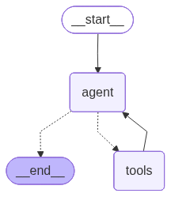

# Product Chatbot API

A fully functional Chatbot REST API built with FastAPI that provides intelligent, human-like responses about product details using Groq LLM and DummyJSON Products API

# 🚀 Features

- Intelligent Chatbot: Uses Groq LLM (llama-3.3-70b-versatile) for natural conversations

- Product Search: Search products by name, brand, or category to get product details

- High-Rated Products: Find products with ratings above specified thresholds

- RESTful API: Clean FastAPI endpoints with proper documentation

- Tool-Based Reasoning: Uses LangGraph for intelligent tool calling (Product Search,High-Rated Products) [tool.py](tool.py)

- Real-time Data: Fetches live product data from [DummyJSON API](https://dummyjson.com/docs)

# Chatbot workfrow
chatbot workflow LangGraph.see workflow_visualization how it works internaly

# 📋 API Endpoints
    GET /api/products
Fetch all products from DummyJSON API

- Response: List of all products with details

    POST /api/chat

Chat with the product bot

- Request: {"message": "Your question here"}

- Response: Intelligent response about products

# 🛠️ Installation & Setup

- python 3.12.0

- Groq API account [Get API key](https://groq.com/)
 
## Project Structure

    server/
    ├── app/
    │   ├── core/
    │   │   └── config.py
    │   ├── models/
    │   │   └── schemas.py
    │   ├── services/
    │   │   ├── chatbot_service.py
    │   │   └── product_service.py
    │   ├── utils/
    │   │   ├── groq_client.py
    │   │   └── tool.py
    │   ├── api/
    │   │   └── routes_chatbot.py
    │   └── main.py
    │   └── .env
    │   └── venv
    ├── README.md
    └── requirements.txt

##  Environment Configuration
Create a .env file in the root directory:

        GROQ_API_KEY=your_groq_api_key_here
        DEBUG=True

## Create virtual environment
in app folder create virtual environment

    cd app 
    python -m venv venv

## Activate virtual environment
### On Windows:
venv\Scripts\activate
##  Install Required packeg
after create venv , then bellow the command run in terminal 

    pip install -r requirements.txt

# Run the Application
after all packeg is installed ,then run this command in tertminal

    uvicorn app.main:app --reload
# Testing the API 
during runnig the project

for Testing the API, used Swagger UI (/docs) or Postman

### Get All Products
    curl -X GET "http://localhost:8000/api/products"

### Chat with Bot
    curl -X POST "http://localhost:8000/api/chat" \
    -H "Content-Type: application/json" \
    -d '{"message": "Show me products with ratings above 4"}'
